# CNotify SDK - iOS

## Installation Step by Step
### 1. Open your project
Selecting your project file (.xcodeproj) with your desired target.
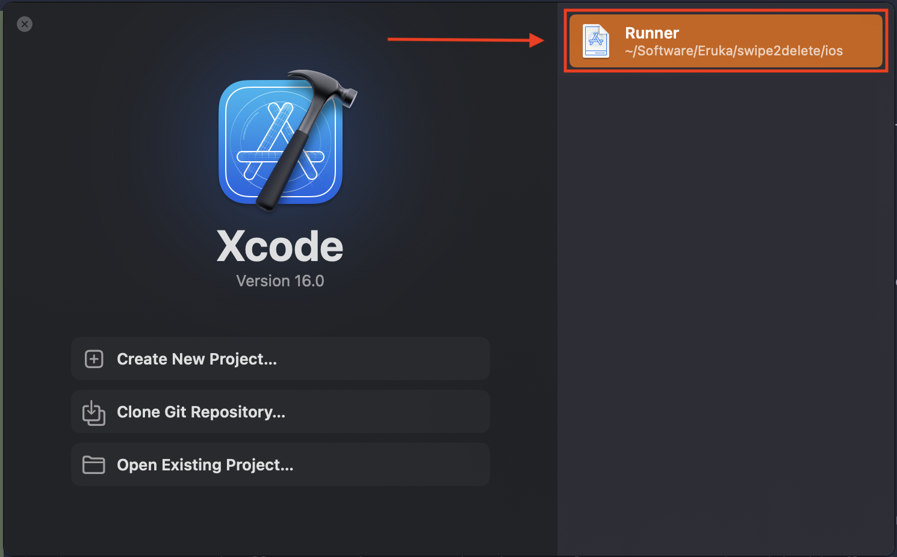

### Notifications Permissions 
#### 2. Go to Signing & Capabilities
⁠In the Signing & Capabilities tab, tap the “+ Capability” button
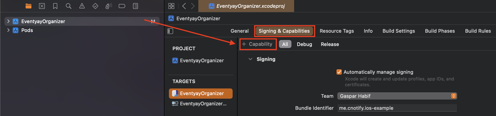

#### 3. Add Notifications Capabilities
##### ⁠3.1 Add the “Push Notifications” Capability
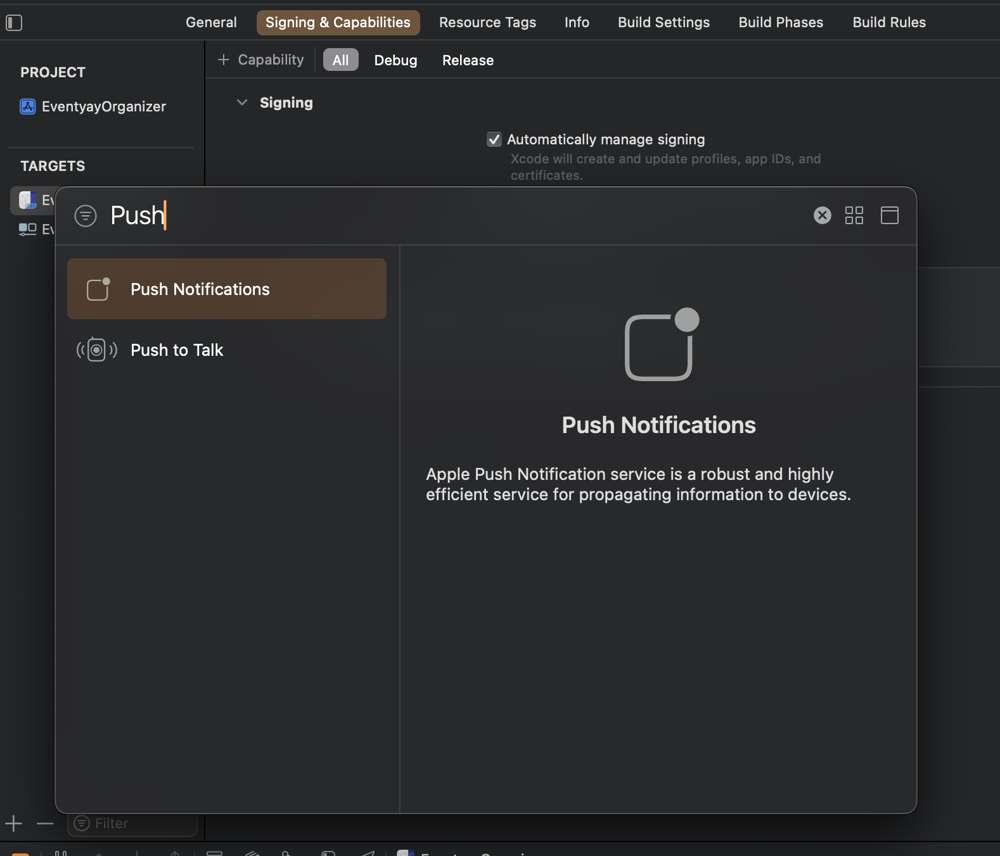
##### 3.2 Add the “Background Modes” Capability.
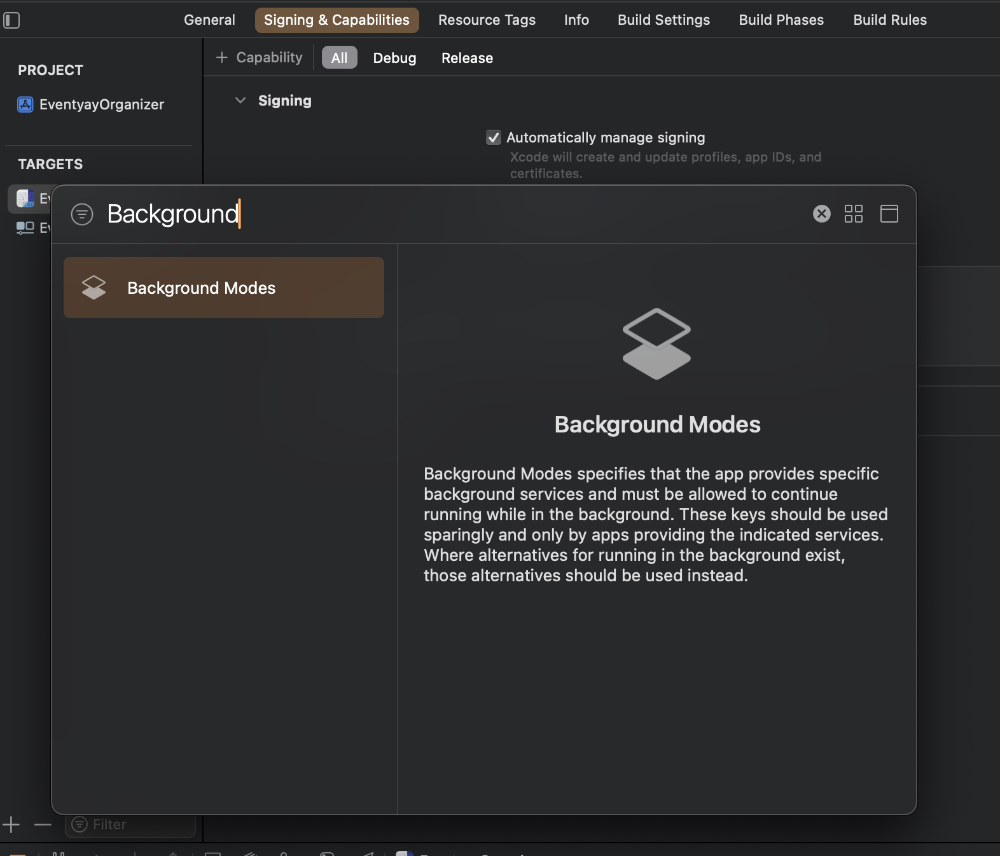

#### 4. Add corresponding Background Modes
At the “Background Modes” toggle in your project's Signing & Capabilities you must check the “Remote notifications” option
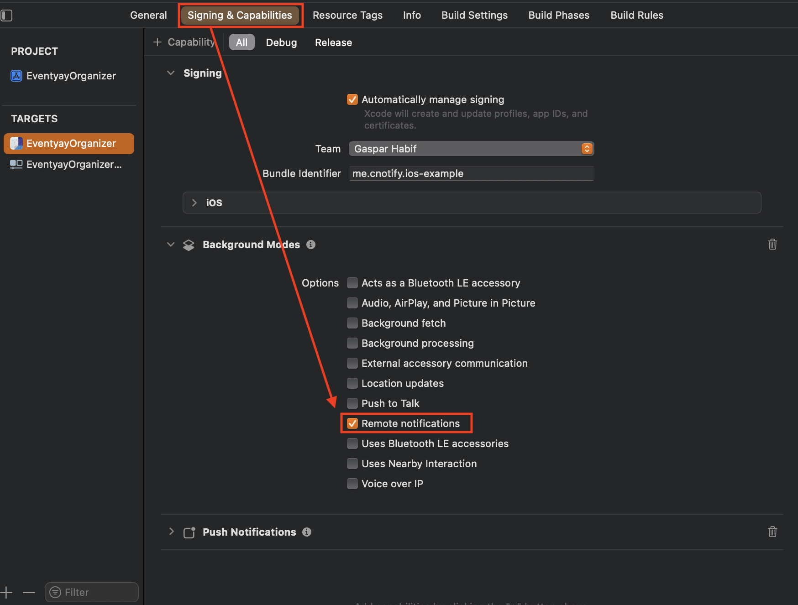

### CNotify Setup
#### 5. Add Package Dependency
⁠It’s time to add CNotify package, to do so go to File -> “Add Package Dependencies”
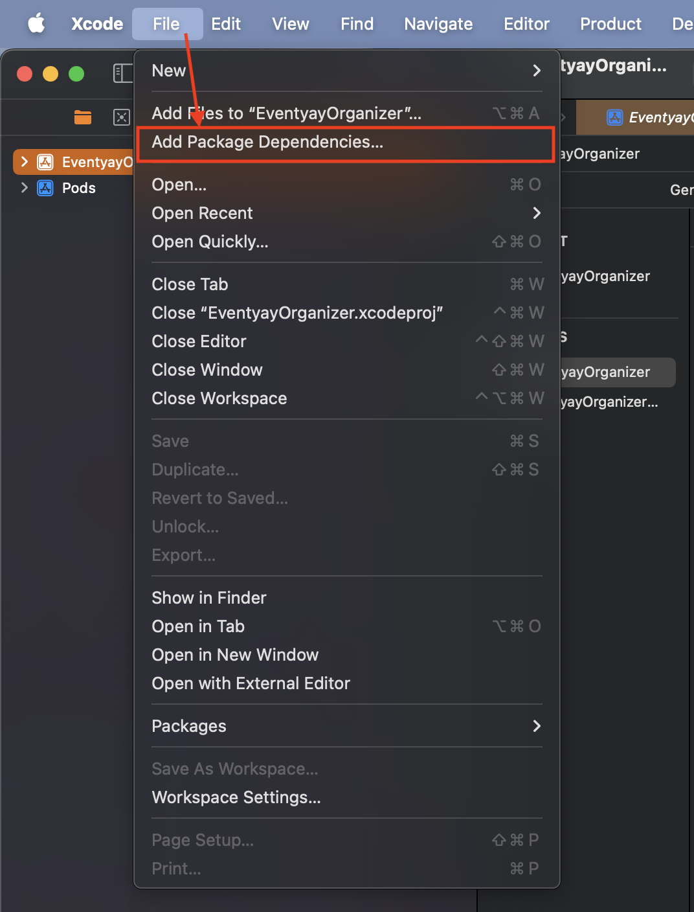

#### 6. Add the CNotify Package
6.1. In the Apple Swift Packages window, tap the search in the upper right corner and paste the following link: `https://github.com/gasparhabif/cnotify-ios-sdk.git`

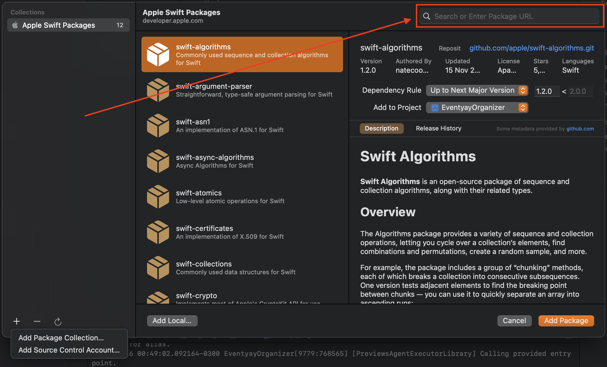
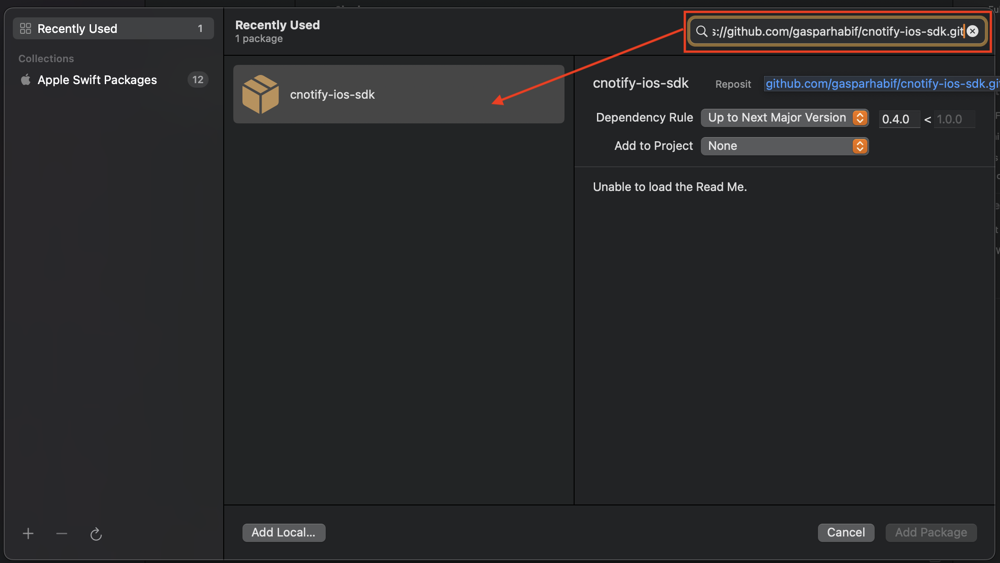

#### 7. Project for the Package 
⁠Select the project to which the package should be added
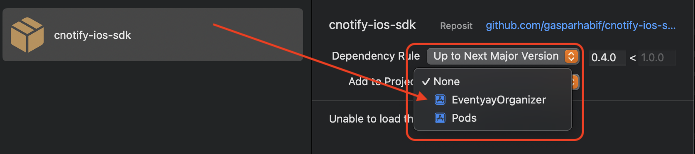

#### 8. Select the Target 
⁠Once it finishes loading select the target and click the "Add package" button. Now the SDK is installed!
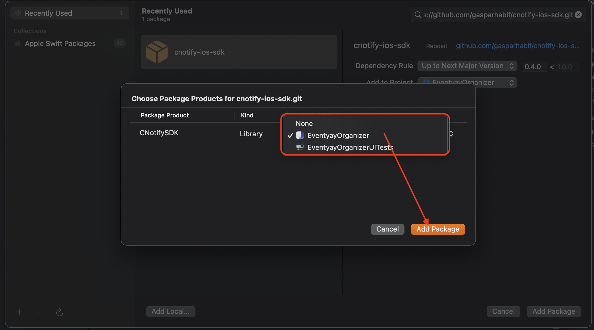

#### 9. Add the initialization code

To initialize the SDK add the following code fragments to the `AppDelegate.swift` or which ever file is your entry point:
```swift
// At the imports level
import CNotifySDK

class …: UIResponder, UIApplicationDelegate {
// Inside your class
var cNotifySDK: CNotifySDK?

// Add the initialization to the main function
    func application(_ application: UIApplication,
                     didFinishLaunchingWithOptions launchOptions: [UIApplication.LaunchOptionsKey: Any]?) -> Bool {

		// You can optionally set testing to true but do not release an app version with this flag in true or users will receive test notifications
		cNotifySDK = CNotifySDK(testing: false)
        return true
    }
    

      // Make sure to add this additional methods
      // This is required for the SDK to work properly. They detect
      // native notifications permissions and registration.
      public func application(_ application: UIApplication, didRegisterForRemoteNotificationsWithDeviceToken deviceToken: Data) {
          cNotifySDK!.application(application, didRegisterForRemoteNotificationsWithDeviceToken: deviceToken)
      }

      public func application(_ application: UIApplication, didFailToRegisterForRemoteNotificationsWithError error: Error) {
          cNotifySDK!.application(application, didFailToRegisterForRemoteNotificationsWithError: error)
      }

}
```
Example: 
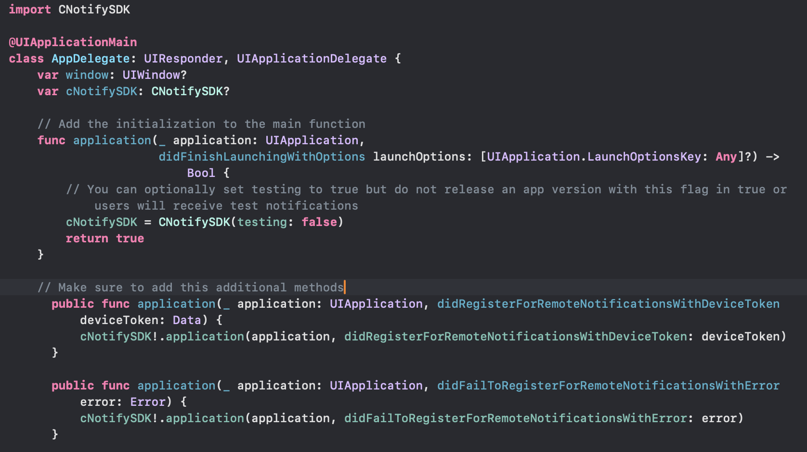


#### 10. Add your GoogleService-Info.plist
Finally, you are almost done. 
##### 10.1 Add your GoogleService-Info.plist to the default (or overriden in case you did) location. Default location is the directory with the name of your project. 
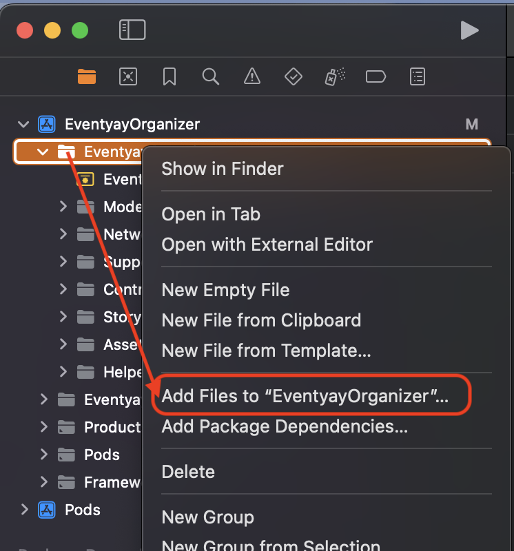
##### 10.2 Make sure to choose “Copy files to destination” and have your target selected
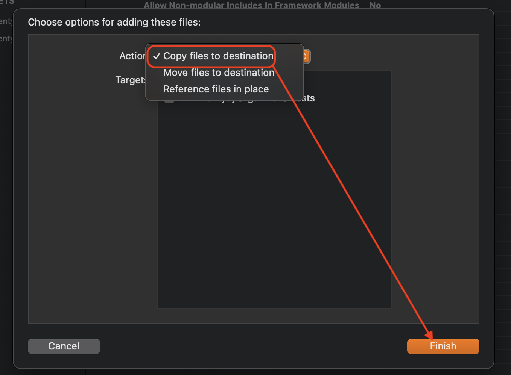

### That's it! Now you can enjoy the SDK.

## Frequent Issues
### Lexical or Preprocessor Issue (Xcode): Include of non-modular header inside framework module

This issue is caused by the way Xcode handles frameworks and modules. To fix it's as simple as changing a setting in Xcode.

1. Open your XCode project, selecting your project.
2. Tap de Build Settings tab and search for "Allow Non-modular Includes In Framework Modules"
3. Change the value to "Yes"
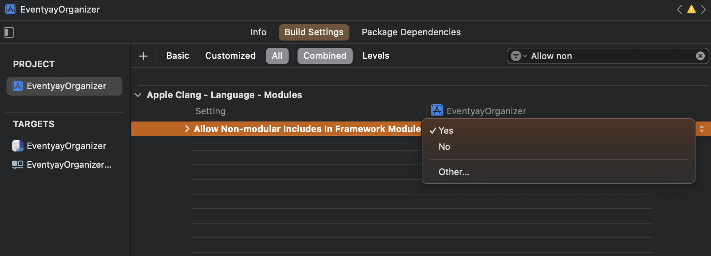


